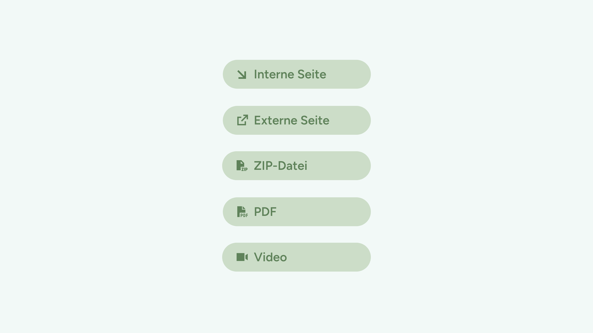
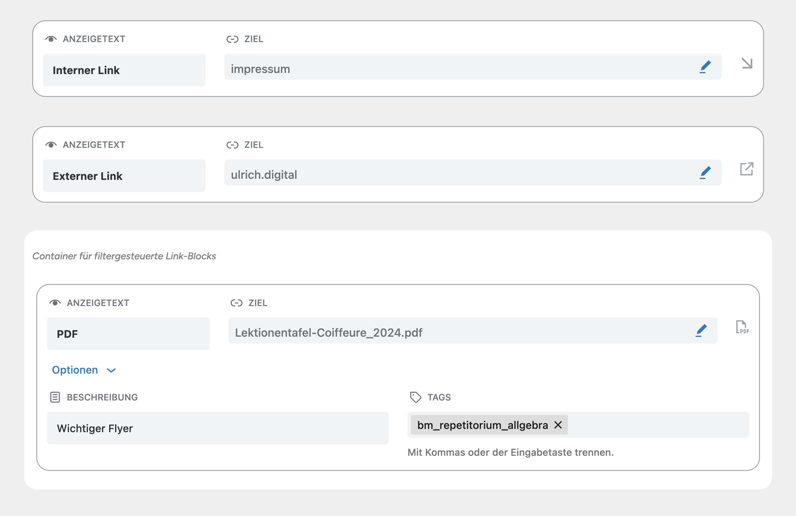

# UD Block: Link 

Ein modularer Block zur Darstellung einzelner Links mit automatischer Icon-Erkennung (z. B. PDF, extern, ZIP, Video).
Der Block wird einzeln oder innerhalb anderer Container-Blöcke – etwa `ud/tagged-links-block` – verwendet, um strukturierte Linklisten aufzubauen.

## Funktionen
- Unterstützt verschiedene Linktypen mit automatischer Icon-Erkennung:
  - Interne Seiten (über Seitenauswahl)
  - Externe Links
  - PDF- und andere Mediendateien (über Medienauswahl)
  - ZIP- und MP4-Dateien 
- Öffnet externe Links und Mediendateien automatisch in einem neuen Tab, interne Links bleiben im selben Tab
- Integration von Schlagwörtern (`data-tags` & `data-tags-slug`)
- Kompatibel mit Full Site Editing (FSE)
- Unterstützt Kombination mit Container-Blöcken wie `ud-tagged-links-block`

## Screenshots

*Darstellung des Link-Blocks mit automatischem Icon.*

*Der Block im Gutenberg-Editor mit Eingabefeldern für Titel, Link und Tags. Optionen werden kontextabhängig eingeblendet.*

## Autor

[ulrich.digital gmbh](https://ulrich.digital)

## Lizenz

GPL v2 or later
[https://www.gnu.org/licenses/gpl-2.0.html](https://www.gnu.org/licenses/gpl-2.0.html)

