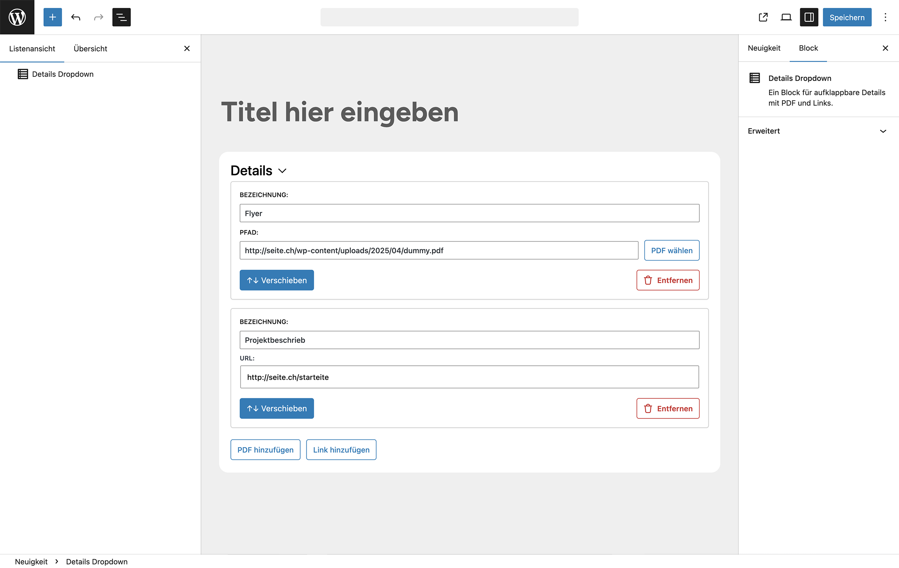
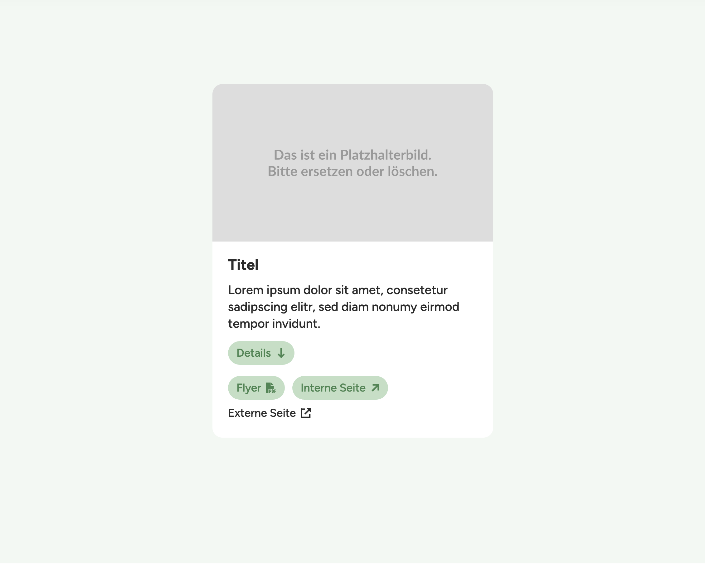

# Link-Block

**Ein flexibler Gutenberg-Block für aufklappbare Inhalte mit PDF- und Link-Funktionalität.**  
Mit diesem Plugin lassen sich strukturierte Linklisten mit internen, externen oder PDF-Links elegant im Editor erstellen – ganz ohne Programmierkenntnisse.

## Funktionen

- Block für aufklappbare Inhalte (Details/Dropdown)
- Drag & Drop-Sortierung der Listeneinträge per `@dnd-kit`
- Unterstützung für:
  - Interne Seiten
  - Externe Links
  - PDF-Dateien (inkl. Upload-Funktion)
- Automatische Icons je nach Linktyp (PDF, extern)
- Benutzerfreundliche Eingabemaske über Gutenberg UI
- DOM-Bereinigung im Frontend:
  - Leere Inhalte und ungenutzte Einträge werden komplett aus dem DOM entfernt
  - Block bleibt nur sichtbar, wenn relevante Inhalte vorhanden sind

## Vorschau im Editor

*Abbildung: Der Block im Editor mit bearbeitbaren Feldern für Linktitel, Linktyp und Reihenfolge.*

*Abbildung: Je nach Kontext werden diverse Optionen angezeigt.*

---

## Darstellung im Frontend

*Abbildung: Die ausgeklappte Liste im Frontend – inklusive Icons für PDFs und externe Links.*

## Besonderheiten

- Kompakte, übersichtliche Darstellung durch Aufklappmechanismus
- Ideal für Download-Bereiche
- Dynamisches Verhalten im Frontend: Animationen, Sichtbarkeitsprüfung, DOM-Optimierung

## Technische Hinweise

* Entwickelt mit [`@wordpress/scripts`](https://developer.wordpress.org/block-editor/reference-guides/packages/packages-scripts/)
* Modularer Aufbau mit getrennten Dateien für `edit.js`, `save.js`, Utility-Komponenten und Styles
* JavaScript-Logik im Frontend entfernt ungenutzte Inhalte zur Laufzeit (statt nur Ausblenden)

## Installation

1. Plugin in den Ordner `wp-content/plugins/` kopieren
2. Im WordPress-Backend aktivieren
