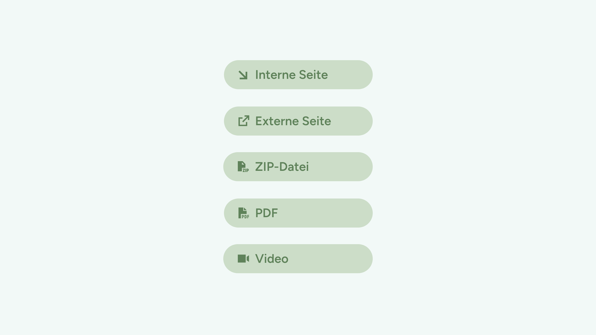
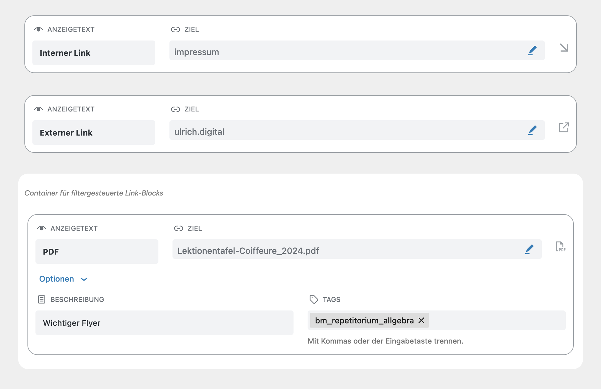

# UD Block: Link

Ein Block zur Darstellung einzelner Links mit automatischer Icon-Erkennung (z. B. PDF, extern, ZIP, Video).
Der Block passt seine verfügbaren Optionen im Editor automatisch an den Kontext an.

## Funktionen
- Unterstützt verschiedene Linktypen mit automatischer Icon-Erkennung:
  - Interne Seiten (über Seitenauswahl)
  - Externe Links
  - PDF- und andere Mediendateien (über Medienauswahl)
  - ZIP- und MP4-Dateien
- Öffnet externe Links und Mediendateien automatisch in einem neuen Tab, interne Links bleiben im selben Tab
- Zeigt im Editor kontextabhängig zusätzliche Optionen:
  - Innerhalb eines `ud-link-filter-container-block` können **Beschreibung** und **Tags** über einen Options-Button eingeblendet werden
  - Ausserhalb dieses Containers bleiben nur **Anzeigetext** und **Ziel** sichtbar
- Kompatibel mit Full Site Editing (FSE)
- Unterstützt Kombination mit Container-Blöcken wie `ud-tagged-links-block`

## Screenshots

*Darstellung des Link-Blocks mit automatischem Icon.*

*Der Block im Gutenberg-Editor mit Eingabefeldern für Titel, Link und Tags. Optionen werden kontextabhängig eingeblendet.*

## Einblicke in die Umsetzung

Der Beitrag gibt Einblick in die entwickelte Lösung und ihre Funktionsweise.

- **Mehr zur Lösung:** [Aufklappbare Linklisten in WordPress verwalten](https://ulrich.digital/uebersichtliche-linklisten-mit-einem-klick/)

## Autor

[ulrich.digital gmbh](https://ulrich.digital)

## Lizenz

Dieses Projekt steht unter der [ulrich.digital Nutzungslizenz 1.0](LICENSE).

Die unveränderte Software darf in eigenen und kommerziellen Projekten eingesetzt werden. Auf jeder öffentlich erreichbaren Website oder Anwendung muss [ulrich.digital gmbh](https://ulrich.digital) im Impressum, in einem Credits-Bereich oder auf einer vergleichbaren Informationsseite genannt werden. Verkauf, eigenständige Weitergabe, Unterlizenzierung und Änderungen bedürfen der vorherigen schriftlichen Zustimmung von ulrich.digital gmbh.

Komponenten Dritter behalten ihre jeweiligen Lizenz- und Nutzungsbedingungen.
